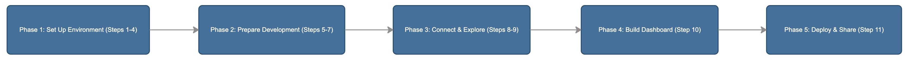
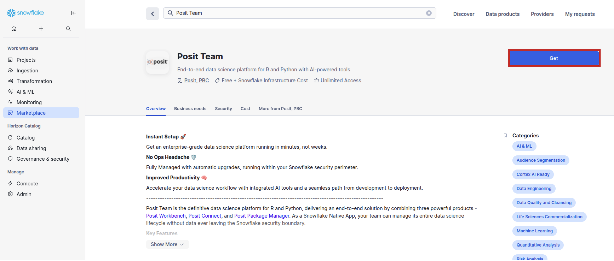
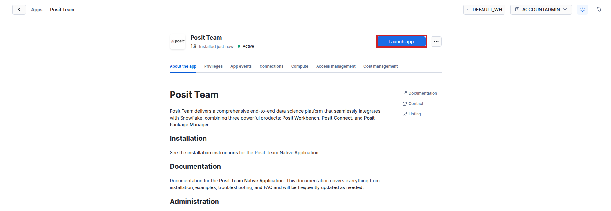
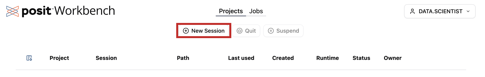
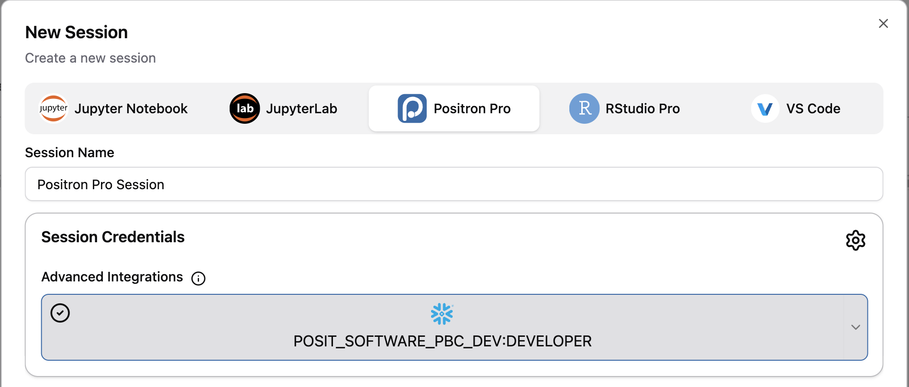
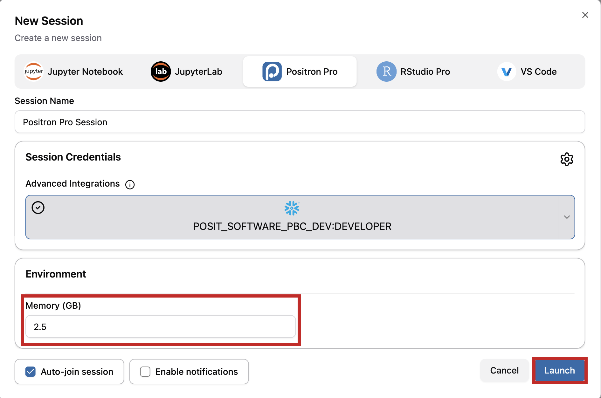
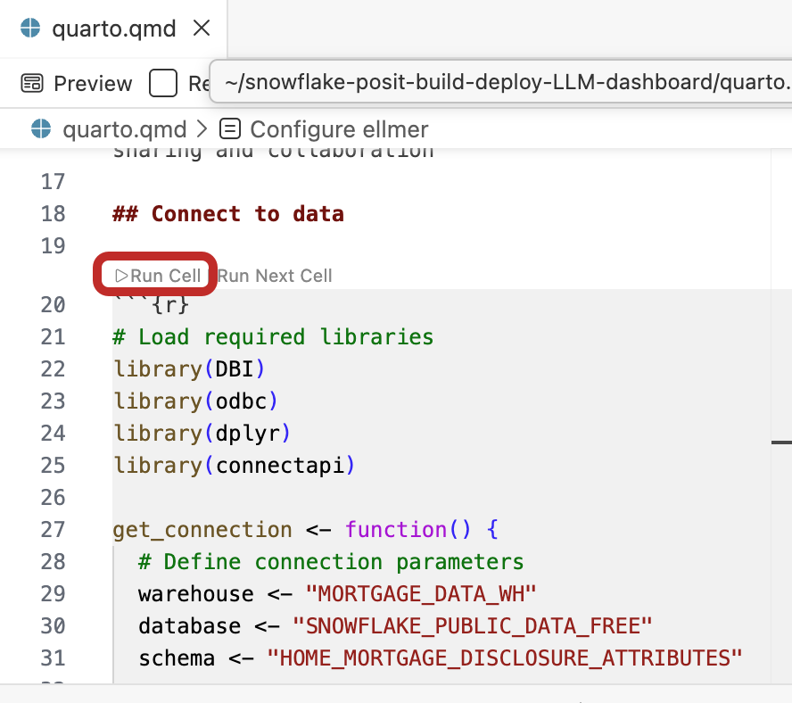
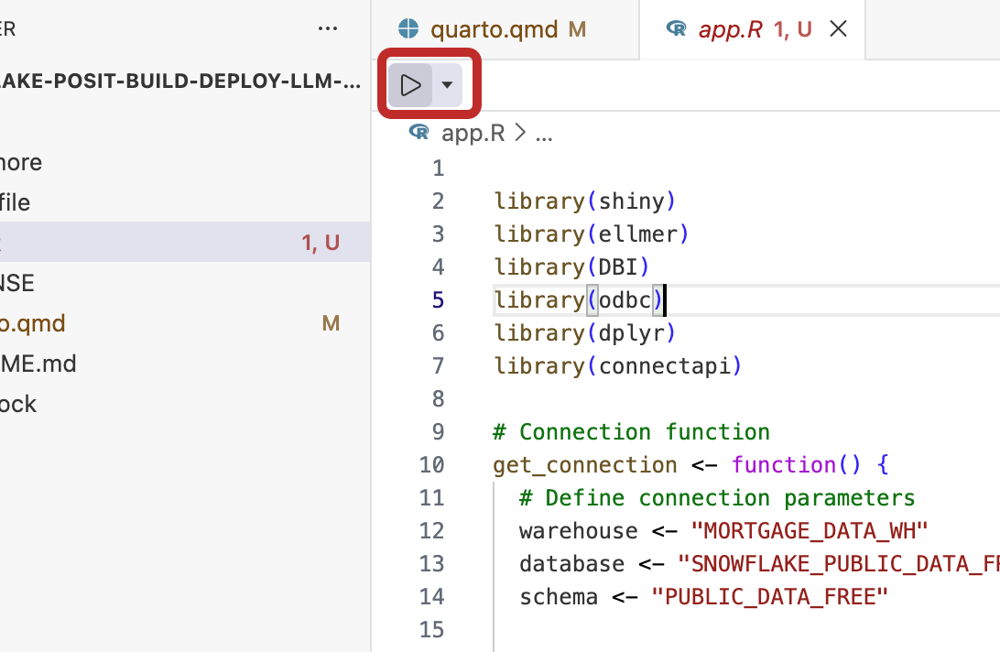
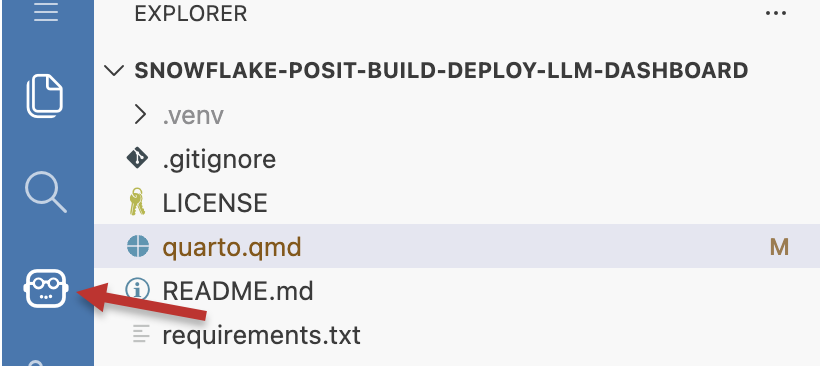
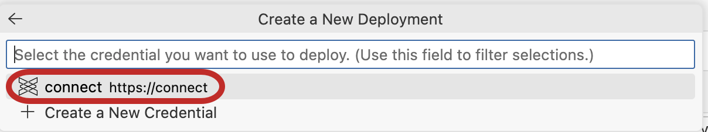

author: Sarah Sdao
id: build-and-deploy-llm-dashboard-with-posit-team-and-cortex
categories: snowflake-site:taxonomy/solution-center/certification/quickstart, snowflake-site:taxonomy/product/ai, snowflake-site:taxonomy/product/data-engineering, snowflake-site:taxonomy/snowflake-feature/cortex-llm-functions, snowflake-site:taxonomy/industry/financial-services
language: en
summary: Build and deploy an interactive LLM-powered dashboard using the Posit Team Native App and Snowflake Cortex
environments: web
status: Published
feedback link: https://github.com/Snowflake-Labs/sfguides/issues

# Build and Deploy an Interactive LLM-Powered Dashboard with the Posit Team Native App and Snowflake Cortex AI

## Overview

In this guide, we'll use the Posit Team Snowflake Native App to build an interactive dashboard that lets users explore Home Mortgage Disclosure Act (HMDA) data
using natural language queries powered by Snowflake Cortex AI. In Posit Workbench, we'll use Positron Assistant and Databot to do some quick, yet powerful
exploratory data analysis and develop a Shiny application using the {querychat} and {ellmer} R packages. Along the way, we'll deploy the interactive
dashboard to Posit Connect in Snowflake with one-click publishing for easy sharing across your organization.



We'll also make sure the shared dashboard respects built-in Snowflake security and authorization settings, ensuring anyone who views the dashboard on
Connect only sees data they have access to.


By the end of this guide, we'll have a fully functional dashboard where users can ask questions like
"What are the most common loan types?" or "How do loan approval rates vary by state?" and get instant visualizations and insights.

### What You Will Learn

- How to securely connect to your Snowflake databases from Workbench and the Positron Pro IDE
- How to leverage Cortex AI using Databot and Positron Assistant to build a Shiny application
- How to create an LLM-powered chat interface for data exploration
- How to deploy and share the dashboard to Connect in Snowflake with one-click publishing

### What You Will Build

- An interactive Shiny dashboard with natural language query capabilities built using Cortex AI
- A published application accessible to your team on Connect in the Posit Team Snowflake Native App

### Prerequisites

- A [Snowflake account](https://signup.snowflake.com/?utm_source=snowflake-devrel&utm_medium=developer-guides&utm_cta=developer-guides) with Cortex AI enabled
- Appropriate access to create data warehouses in Snowflake. This is typically the `sysadmin` role
- Access to an installed and configured [Posit Team Snowflake Native App](https://app.snowflake.com/marketplace/listing/GZTSZMCB9S/posit-pbc-posit-team). An administrator with the `accountadmin` role can provide this access
- Access to the [`SNOWFLAKE_PUBLIC_DATA_FREE` database](https://app.snowflake.com/marketplace/listing/GZTSZ290BV255/snowflake-public-data-products-snowflake-public-data-free) in Snowsight
- Familiarity with SQL and R

## Phase 1: Set Up Your Environment

### Step 1: Create a Warehouse

For this analysis, we'll use the Home Mortgage Disclosure Act (HMDA) dataset from Snowflake's free public database. This dataset contains mortgage application and
origination data collected under the HMDA, including information about loan types, applicant demographics, property characteristics, and loan outcomes across different geographic areas.

To work with the dataset, we need a warehouse for our analysis. In Snowsight, open a SQL worksheet (**+** > **SQL File**). Then, paste in and run the following code. Make sure to
change the role to your own role.

```sql
USE ROLE SYSADMIN; -- Replace with your actual Snowflake role (e.g., sysadmin)

CREATE OR REPLACE WAREHOUSE MORTGAGE_DATA_WH
    WAREHOUSE_SIZE = 'xsmall'
    WAREHOUSE_TYPE = 'standard'
    AUTO_SUSPEND = 60
    AUTO_RESUME = TRUE
    INITIALLY_SUSPENDED = TRUE;
```

This command creates a small warehouse called `MORTGAGE_DATA_WH` that will be used to query the public dataset. Contact your account administrator if find you do not
have the correct role to do this.

### Step 2: Access the HMDA Dataset

The HMDA dataset we'll use is located at:

- **Database:** `SNOWFLAKE_PUBLIC_DATA_FREE`
- **Schema:** `PUBLIC_DATA_FREE`
- **Table:** `HOME_MORTGAGE_DISCLOSURE_ATTRIBUTES`

To verify you have access to this data, run the following query in your SQL worksheet:

```sql
SELECT *
FROM SNOWFLAKE_PUBLIC_DATA_FREE.PUBLIC_DATA_FREE.HOME_MORTGAGE_DISCLOSURE_ATTRIBUTES
LIMIT 10;
```

You should see the first 10 rows of the HMDA dataset, which includes columns about mortgage applications, loan details, applicant information, and property characteristics.

If you find that do not have access to this dataset, please contact your account administrator.

### Step 3: Launch Posit Workbench from the Posit Team Native App

We can now start exploring the data using Posit Workbench. You can find Workbench within the Posit Team Native App, and use it to connect to your database.

#### Get the Posit Team Native App from the Snowflake Marketplace

- In Snowsight, click on **Marketplace**. If the Posit Team Native App is not already installed, search for "Posit Team" and then click **Get**.

  

- You might be asked to validate your email address.
- Choose a name for the App.

#### Open the Posit Team Native App from Snowsight

   > **Note:** Your administrator must first [install and configure](https://docs.posit.co/partnerships/snowflake/posit-team/) the Posit Team Native App--plus the products within it--before you can follow the remaining steps.

Once your administrator has installed and configured the Posit Team Native App, in Snowsight, navigate to **Horizon Catalog** > **Catalog** > **Installed Apps** > the Posit Team Native App. If you do not see the
Posit Team Native App listed, ask your Snowflake account administrator for access to the app.

After clicking on the app, you will see the Posit Team Native App page.

Click **Launch app**.



#### Open Workbench from the Posit Team Native App

From the Posit Team Native App, click **Posit Workbench**.


You might be prompted to first log in to Snowflake using your regular credentials or authentication method.

### Step 4: Create a Positron Pro Session

Workbench provides several IDEs, including Positron Pro, VS Code, RStudio Pro, and JupyterLab. For this analysis, we will use Positron, the next-generation
data science IDE built for Python and R. It combines the power of a full-featured IDE with interactive data science tools for Python and R.

#### New Session

Within Workbench, click **+ New Session** to launch a new session.



#### Select an IDE

When prompted, select Positron Pro. You can optionally give your session a unique name.


#### Log into your Snowflake account

Next, connect to your Snowflake account from within Workbench.
Under **Session Credentials**, click the button with the Snowflake icon to sign in to Snowflake. Follow any sign in prompts.



#### Launch Positron Pro

Under **Environment**, enter at least 2.5 GB of RAM in the **Memory (GB)** field.

Then, click **Launch** to launch Positron Pro. If desired, you can check the **Auto-join session** option to automatically open the IDE when the session is ready.



You will now be able to work with your Snowflake data in Positron Pro. Since the IDE is provided
by Workbench within the Posit Team Native App, your entire analysis will occur securely within Snowflake.

#### Install the Necessary Extensions

The analysis contained in this guide requires you to have some extensions installed. You can install them from the [Extensions view](https://docs.posit.co/ide/server-pro/user/positron/guide/extensions.html).

#### Get the Shiny Extension

The Shiny VS Code extension supports the development of Shiny apps in Positron. The Shiny Extension is included automatically in Positron as a [bootstrapped extension](https://positron.posit.co/extensions.html#bootstrapped-extensions).

First, we need to make sure we have it installed and enabled:

1. Open the Positron Extensions view: on the left-hand side of Positron Pro, click the Extensions icon in the activity bar to open the Extensions Marketplace.

2. Search for "Shiny" to find the Shiny extension.


3. Verify that you have the Shiny extension:
  - If it is already installed and enabled, you will see a wheel icon.
  - If it is not already installed, click **Install**.
  - If you cannot install it yourself or you find that the extension is disabled, ask your administrator for access.

For more information, see the [Shiny extension documentation](https://open-vsx.org/extension/posit/shiny).

#### Get the Posit Publisher Extension

[Posit Publisher](https://docs.posit.co/connect/user/publishing-positron-vscode/) lets you start the deployment of projects to Connect from Positron with a single click.

1. Open the Positron Extensions view: on the left-hand side of Positron Pro, click the Extensions icon in the activity bar to open the Extensions Marketplace.

2. Search for "Posit Publisher".

3. Click **Install** to add the Publisher extension.

## Phase 2: Prepare Your Development Environment

### Step 5: Access this Guide's Materials

This guide will walk you through the steps contained in <https://github.com/posit-dev/snowflake-posit-build-deploy-LLM-dashboard>. To follow along, clone the repository by following the steps below.

1. Open your home folder:

   - Press `Ctrl/Cmd+Shift+P` to open the Command Palette.
   - Type "File: Open Folder", and press `enter`.
   - Navigate to your home directory and click **OK**.

2. Clone the [GitHub repo](https://github.com/posit-dev/snowflake-posit-build-deploy-LLM-dashboard/) by running the following command in a terminal:

   ```bash
   git clone https://github.com/posit-dev/snowflake-posit-build-deploy-LLM-dashboard/
   ```

   > If you don't already see a terminal open, open the Command Palette (`Ctrl/Cmd+Shift+P`), then select **Terminal: Create New Terminal** to open one.

   > **Note:** This guide uses HTTPS for git authentication. Standard git authentication procedures apply.

3. Open the cloned repository folder:

   - Press `Ctrl/Cmd+Shift+P` to open the Command Palette.
   - Select **File: Open Folder**.
   - Navigate to `snowflake-posit-build-deploy-LLM-dashboard` and click **OK**.

## Explore Quarto

Before we dive into our data analysis, let's first discuss Quarto. We've documented the code for this guide in a Quarto document,
[quarto.qmd](https://github.com/posit-dev/snowflake-posit-build-deploy-LLM-dashboard/blob/main/quarto.qmd).

[Quarto](https://quarto.org/)
is an open-source publishing system that makes it easy to create
[data products](https://quarto.org/docs/guide/) such as
[documents](https://quarto.org/docs/output-formats/html-basics.html),
[presentations](https://quarto.org/docs/presentations/),
[dashboards](https://quarto.org/docs/dashboards/),
[websites](https://quarto.org/docs/websites/),
and
[books](https://quarto.org/docs/books/). It is available out-of-the-box with Positron Pro and allows data scientists to interweave all of their code, results, output, and prose text into a single
literate programming document. This way everything travels together as a reproducible data product.

A Quarto document can be thought of as a regular markdown document, but with the ability to run code chunks.

You can run any of the code chunks by clicking the `Run Cell` button above the chunk in Positron Pro.



To render and preview the entire document, click the `Preview` button or run `quarto preview quarto.qmd` from the terminal.


This will run all the code in the document from top to bottom and generate an HTML file, by default, for you to view and share.
This is especially helpful for creating multiple plots and other static content.

Learn more about Quarto here: <https://quarto.org/>,
and the documentation for all the various Quarto outputs here: <https://quarto.org/docs/guide/>.
Quarto works with R, Python, and JavaScript Observable code out-of-the-box, and is a great tool to communicate your data science analyses.

### Step 6: Install R Packages from `renv.lock`

Our analysis uses the following R packages: [{connectapi}](https://pkgs.rstudio.com/connectapi/index.html), [{DBI}](https://dbi.r-dbi.org/),
[{dplyr}](https://dplyr.tidyverse.org/), [{dbplyr}](https://dbplyr.tidyverse.org/articles/dbplyr.html), [{ellmer}](https://ellmer.tidyverse.org/), [{querychat}](https://posit-dev.github.io/querychat/r/index.html),
[{ggplot2}](https://ggplot2.tidyverse.org/) and [{shiny}](https://shiny.posit.co/r/getstarted/shiny-basics/lesson1/),
plus more for advanced data analysis and deployment to Connect.

These dependencies are all found in the file `renv.lock`. We can automatically install all dependencies by running the `renv::restore()`
function. These dependencies will carry over to our Connect deployment as well.

Open the `quarto.qmd` file in your current directory in Positron. Then run the following code chunk:

```r
install.packages("renv")
renv::restore()
```

You might need to restart your R session once all dependencies are set. Restart your session by clicking the refresh icon above the R console.


## Phase 3: Connect and Explore

### Step 7: Connect to Snowflake Data

Now that we have our Positron Pro session started with the necessary extensions and dependencies, we can connect to our data in Snowflake.
There are two ways we can do this: automatically by prompting Databot, or by running some code ourselves.

#### Use Databot to Connect

   > **Important:** Databot is currently in research preview.

[Databot](https://positron.posit.co/databot.html) is an AI assistant designed to dramatically accelerate exploratory data analysis for data scientists fluent in R or Python, allowing them to do in minutes what might usually take hours.

<!-- This section relies on the PR in the databot repo being merged + feature released -->

Instead of manually writing connection code, you can use Databot's built-in Snowflake skill to guide you through the connection process. This is
especially helpful when you're working in Workbench, as Databot can automatically detect and use managed credentials.

  > **Note:** You must be running Databot v0.0.41 or higher to use it to connect to Snowflake data.

1. Open the Command Palette (`Cmd/Ctrl+Shift+P`).

2. Type "Databot" and select **Open Databot in Editor Panel**.

3. The Databot panel will open, ready to analyze your mortgage data. Ensure you are still in your R session within the Databot dialog.

In the Databot panel, simply enter:

```
Help me connect to Snowflake
```

Databot will:

1. Detect if you're in Workbench with integrated authentication.
2. Provide the appropriate connection code for your environment.
3. Guide you through discovering available databases, schemas, and tables.
4. Help you explore Semantic Views if available.

If you're in Workbench, Databot will provide zero-argument connection code that uses managed credentials. This was determined and securely set above in
[Log in to your Snowflake Account](#log-into-your-snowflake-account).

```r
library(DBI)
library(odbc)

# Uses Workbench managed credentials automatically
con <- DBI::dbConnect(
  odbc::snowflake(),
  connection_name = "workbench"
)
```

Once connected, you can move on to the next section, which is to [configure the {querychat} and {ellmer} packages to work with your Cortex AI-provided LLM](#configure-your-settings).

#### Connect with Code

You can also connect to your data using the `quarto.qmd` file from `snowflake-posit-build-deploy-LLM-dashboard`. Click the **Run Cell** button to run the next R code chunk in the `quarto.qmd` file.

The code uses {dplyr}, which provides an intuitive way to work with database tables in R. To ensure our connection works across different environments (development,
Workbench, and Connect), the code uses {dbplyr}, {DBI}, {odbc}, and {connectapi} to create a flexible connection function:

- **Local development**: Uses explicit credentials
- **Workbench**: Leverages managed credentials via `connection_name="workbench"`
- **Connect**: Uses viewer credentials via OAuth, ensuring each user connects with their own Snowflake credentials, which respects
Snowflake's Role-Based Access Control (RBAC)

```r
library(DBI)
library(odbc)
library(dplyr)
library(dbplyr)
library(connectapi)

get_connection <- function() {
  warehouse <- "MORTGAGE_DATA_WH"
  database <- "SNOWFLAKE_PUBLIC_DATA_FREE"
  schema <- "PUBLIC_DATA_FREE"

  if (!is.null(Sys.getenv("SNOWFLAKE_HOME", unset = NULL)) &&
      Sys.getenv("RSTUDIO_PRODUCT") != "CONNECT") {
    con <- DBI::dbConnect(
      odbc::snowflake(),
      connection_name = "workbench",
      warehouse = warehouse,
      database = database,
      schema = schema
    )
  } else if (Sys.getenv("RSTUDIO_PRODUCT") == "CONNECT") {
    client <- connectapi::connect()
    user_session_token <- shiny::session$request$HTTP_POSIT_CONNECT_USER_SESSION_TOKEN
    credentials <- connectapi::get_oauth_credentials(client, user_session_token)
    token <- credentials$access_token

    con <- DBI::dbConnect(
      odbc::snowflake(),
      account = "YOUR_ACCOUNT",
      warehouse = warehouse,
      database = database,
      schema = schema,
      authenticator = "OAUTH",
      token = token
    )
  } else {
    stop("No Snowflake credentials found.")
  }
  return(con)
}

con <- get_connection()
mortgage_data <- tbl(con, "HOME_MORTGAGE_DISCLOSURE")
message("Successfully established secure connection to Snowflake!")
```

We have now used Workbench, Positron, and R to connect to the HMDA mortgage data in Snowflake's public datasets, all securely within Snowflake.

### Step 8: Explore the Data with Databot

Before building our dashboard, let's use Databot to explore the mortgage data. Databot is an AI assistant in research preview
that dramatically accelerates exploratory data analysis (EDA) in R, enabling you to complete analyses in minutes rather than hours.
Unlike general coding assistants, Databot is purpose-built for EDA with rapid iteration of short code snippets that execute quickly.

#### Open Databot

If you didn't connect to your data with Databot previously, open Databot by following these steps:

1. Open the Command Palette (`Cmd/Ctrl+Shift+P`).

2. Type "Open Databot" and select **Open Databot in Editor panel**.

3. The Databot panel will open, ready to analyze your mortgage data. Ensure you are still in your R session within the Databot dialog.

#### Explore the Mortgage Data

With your connection to the `HOME_MORTGAGE_DISCLOSURE` table established (from the previous section), you can now ask Databot
to explore the data. Try these prompts:

**Understand the dataset structure:**

```
Explore the mortgage_data and summarize its structure
```

Databot will generate and execute code to show you the columns, data types, and basic statistics.

**Investigate specific patterns:**

```
Explore the relationship between loan amounts and property types
```

Databot will create visualizations and statistical summaries to help you understand lending patterns.

**Compare trends across geography:**

```
How do loan approval rates vary across different states?
```

Databot will analyze geographic patterns and create appropriate visualizations.

**Identify data quality issues:**

```
Check for missing values and data quality issues in the mortgage data
```

Databot will examine the dataset for completeness and potential problems.

#### Review Generated Code

As Databot works, it will show you the code it generates before executing it. Review this code to:

- Verify the analysis approach is appropriate
- Understand the transformations being applied
- Learn techniques you can reuse in your own work
- Catch any potential issues before execution

## Phase 4: Build Your Dashboard

### Step 9: Build the LLM Dashboard

Now that we've done some exploratory data analysis, let's create our interactive dashboard. First we need to configure {ellmer} and {querychat} to use Cortex AI.
Then we can build the Shiny app.

#### Configure your settings

Before testing the connection, let's capture your settings for use in the dashboard:

```r
# Capture user settings
cortex_model <- "claude-3-7-sonnet"

message("Settings captured:")
message("- Cortex AI Model: ", cortex_model)
```

#### Test {ellmer} connection

When we installed the R packages earlier, {ellmer} was included. However, we still need to configure it to use a Cortex AI-provided LLM and our mortgage data.

The {ellmer} package provides a `chat_snowflake()` function that integrates with Snowflake Cortex AI.

```r
library(ellmer)

# Initialize chat with Snowflake Cortex AI using your settings
library(ellmer)

# Initialize chat_snowflake with Snowflake Cortex AI using your settings
chat <- chat(
  name = paste0("snowflake/", cortex_model),
  system_prompt = "You are a mortgage lending and housing finance data analysis expert",
  account = Sys.getenv("SNOWFLAKE_ACCOUNT")
)

# Test the connection
response <- chat$chat("What patterns do you see in home mortgage lending data?")
cat(response)
```

When you run the cell, the response output will appear in the console.

#### OPTIONAL: Explore with {querychat}

   >  **Note:** `querychat_app()` launches an interactive application that will block further code execution. Close the app
   and stop the function when you're done exploring to continue with the next steps.

{querychat} creates interactive chat interfaces for data exploration. If you want to interactively explore the data before
building your custom Shiny app, you can run the function below.

Building on the database and model connection we established above, we can configure {querychat} to work with our mortgage data:

```r
library(querychat)

querychat_app(
  data = mortgage_data,
  client = chat  # Use the configured Snowflake Cortex AI chat
)
```

The `querychat_app()` function creates an application that allows users to ask natural language questions about the data. It uses:

- `data`: The database table connection (using `dplyr::tbl()`)
- `client`: The {ellmer} chat object configured with Snowflake Cortex AI

This simple configuration creates a full interactive dashboard where users can explore the HMDA mortgage data using natural language queries.

#### Build a Shiny App

Now let's run the following code, which will build a very simple Shiny App to explore the data with {ellmer}.
Running this code will create a new `app.R` file in the current directory that contains all of your already-established user settings.

```r
# Create app.R file with Shiny application code using your captured settings
app_code <- sprintf('
library(shiny)
library(ellmer)
library(DBI)
library(odbc)
library(dplyr)
library(dbplyr)
library(connectapi)

# Connection function
get_connection <- function() {
  # Define connection parameters
  warehouse <- "MORTGAGE_DATA_WH"
  database <- "SNOWFLAKE_PUBLIC_DATA_FREE"
  schema <- "PUBLIC_DATA_FREE"

  # Running in Posit Workbench
  if (nzchar(Sys.getenv("SNOWFLAKE_HOME")) &&
      Sys.getenv("RSTUDIO_PRODUCT") != "CONNECT") {

    con <- DBI::dbConnect(
      odbc::snowflake(),
      connection_name = "workbench",
      warehouse = warehouse,
      database = database,
      schema = schema
    )

  # Running in Posit Connect (deployed app)
  } else if (Sys.getenv("RSTUDIO_PRODUCT") == "CONNECT") {

    # Get Posit Connect client and user session token
    client <- connectapi::connect()
    user_session_token <- shiny::session$request$HTTP_POSIT_CONNECT_USER_SESSION_TOKEN

    # Get OAuth credentials for the viewer
    credentials <- connectapi::get_oauth_credentials(client, user_session_token)
    token <- credentials$access_token

    con <- DBI::dbConnect(
      odbc::snowflake(),
      account = Sys.getenv("SNOWFLAKE_ACCOUNT"),
      warehouse = warehouse,
      database = database,
      schema = schema,
      authenticator = "OAUTH",
      token = token
    )

  } else {
    stop("No Snowflake credentials found. Ensure you are running in Workbench or Connect.")
  }

  return(con)
}

# Define UI
ui <- fluidPage(
  titlePanel("HMDA Data Explorer with Snowflake Cortex AI"),
  sidebarLayout(
    sidebarPanel(
      textAreaInput("user_question", "Ask a question about mortgage data:",
                    placeholder = "What are the most common loan types?"),
      actionButton("ask", "Ask Cortex AI")
    ),
    mainPanel(
      h4("AI Response:"),
      verbatimTextOutput("response"),
      h4("Data Results:"),
      tableOutput("results")
    )
  )
)

# Define server
server <- function(input, output, session) {
  # Initialize connection and chat
  con <- get_connection()
  mortgage_data <- tbl(con, "HOME_MORTGAGE_DISCLOSURE_ATTRIBUTES")

  chat <- chat(
  name = paste0("snowflake/", "%s"),  # Your chosen Cortex AI model
  system_prompt = paste(
    "You are a mortgage lending data expert.",
    "Help users understand HMDA mortgage data patterns and insights.",
    "When asked about data, suggest relevant SQL queries or analyses."
  ),
  account = Sys.getenv("SNOWFLAKE_ACCOUNT")
  )

  observeEvent(input$ask, {
    req(input$user_question)

    output$response <- renderText({
      chat$chat(input$user_question)
    })

    # Example: Could execute data queries based on the question
    # This would require parsing the question or using AI to generate queries
  })
}

# Run the application
shinyApp(ui = ui, server = server)
', cortex_model)

# Write the app code to app.R file
writeLines(app_code, "app.R")

message("Shiny app created successfully with your settings!")
message("- Cortex AI Model: ", cortex_model)
message("\nRun the app with: shiny::runApp('app.R')")
```

Open the new `app.R` file and click the **Run App** icon to view and use the Shiny app in the **Viewer** pane.



#### Start a Chat with Positron Assistant

The code above provided a very simple Shiny app, which we might want to adjust to be more visually appealing. Let's let Positron Assistant handle that for us based on our natural language prompts.

To start a chat with Positron Assistant, click on the Positron Assistant icon in the toolbar:



Select a model from the available options. For best results with Cortex AI, we recommend using Claude Sonnet 4.5.

You can ask Positron Assistant to help improve your Shiny app. Try something like:

```
Can you help me make the app.R file more dynamic and colorful?
```

Continue to iterate on the Shiny app until you are happy with how it looks and acts.

## Phase 5: Deploy and Share

### Step 10: Deploy to Posit Connect

Now that your dashboard works locally and looks how you'd like it to, let's deploy it to Connect so your team can access it. Deployment is a one-click process.
Because Workbench and Connect run within the same Native App, the complex network and authentication challenges are eliminated.
Once you click deploy in Positron, Connect handles dependency management and ensures your code runs successfully as a deployed artifact.

1. In the Positron tool menu, click the Posit Publisher icon.


2. Under **Deployment**, click the **Select..** dropdown. Since this is the first time we've deployed this content,
you'll be prompted to create a new deployment. Select the `app.R` file to deploy.

3. Select the Connect deployment.



4. Select the files to include:
- [x] `app.R`
- [x] `renv.lock`

2. Click the **Deploy your project** button.

3. Once deployment is successful, click **View** to open your deployed dashboard.

### Step 11: Access Your Dashboard on Connect

After clicking **View**, your dashboard will open in Connect where you can interact with it and share it with your team.

1. Test your deployed dashboard to ensure it's working as expected.

2. To share your dashboard with others, click the **Settings** pane in the upper-right-hand corner of the content page.

3. In the **Content URL** section, copy the URL.

4. Share this URL with your team.

> **Note:** Your dashboard automatically uses viewer-level authentication. Each user who accesses the dashboard will connect with their own Snowflake credentials, ensuring they only see data they have permission to access.

## Conclusion and Resources

### Overview

In this guide, we built a complete LLM-powered dashboard for exploring HMDA mortgage data. We created a Snowflake warehouse
to query public data, explored data with Databot and {querychat}, developed a Shiny application using Positron Assistant
and Databot with the {ellmer} R package, and deployed the dashboard to Posit Connect where your team can access it securely.

The steps we took along the way easily transfer to other datasets and use cases. This pattern of combining Snowflake's data platform and Cortex AI
with Posit's authoring and publishing tools enables you to build and share powerful data applications quickly.

### What You Learned

- How to access and query Snowflake public datasets using R
- How to use Databot for exploratory data analysis
- How to build with multiple environments in mind using connection code that works seamlessly in Workbench, Connect, and local development
- How to implement viewer-level authentication to ensure each user connects to Snowflake with their own credentials
- How to create LLM-powered interfaces by configuring {ellmer} and {querychat} to enable natural language data exploration with Snowflake Cortex AI
- How to publish Shiny applications to Connect with one-click deployment from Workbench

### Resources

- **Snowflake Cortex AI Documentation**: [Cortex AI Functions](https://docs.snowflake.com/en/user-guide/snowflake-cortex/llm-functions)
- **Snowflake Public Data**: [Using Snowflake Data Marketplace](https://docs.snowflake.com/en/user-guide/data-marketplace)
- **Positron**: [Positron Documentation](https://positron.posit.co/)
- **Databot**: [Databot Documentation](https://positron.posit.co/databot.html)
- **{ellmer}**: [Documentation](https://ellmer.tidyverse.org/)
- **{querychat}**: [Documentation](https://posit-dev.github.io/querychat/)
- **Shiny for R**: [Documentation](https://shiny.posit.co/)
- **Posit Workbench**: [User Guide](https://docs.posit.co/ide/server-pro/user/)
- **Posit Connect**: [User Guide](https://docs.posit.co/connect/user/)
- **Related Guides**: [Analyze Data with Python Using Posit Team](https://quickstarts.snowflake.com/guide/analyze-data-with-python-using-posit-team/)
