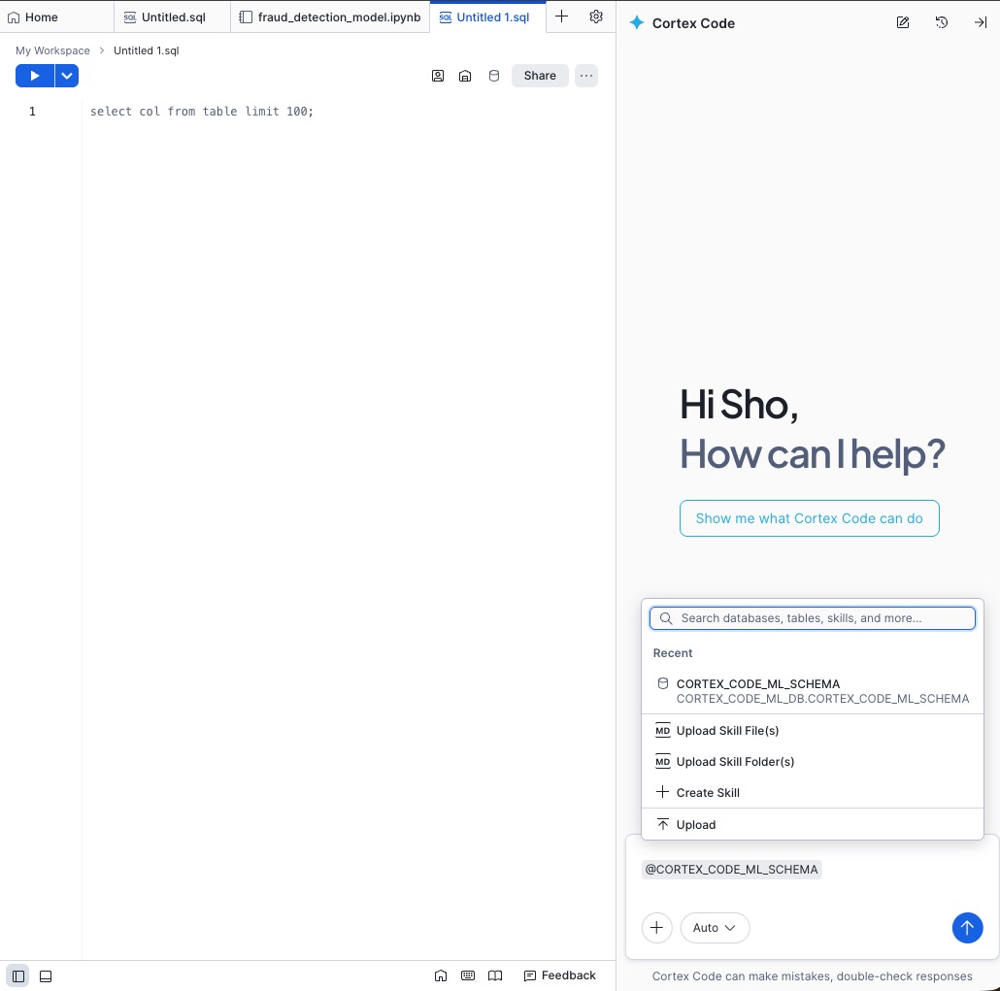
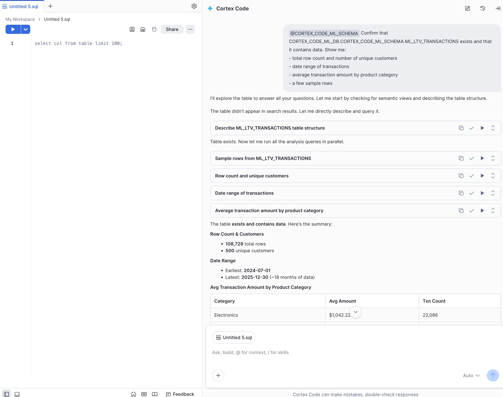
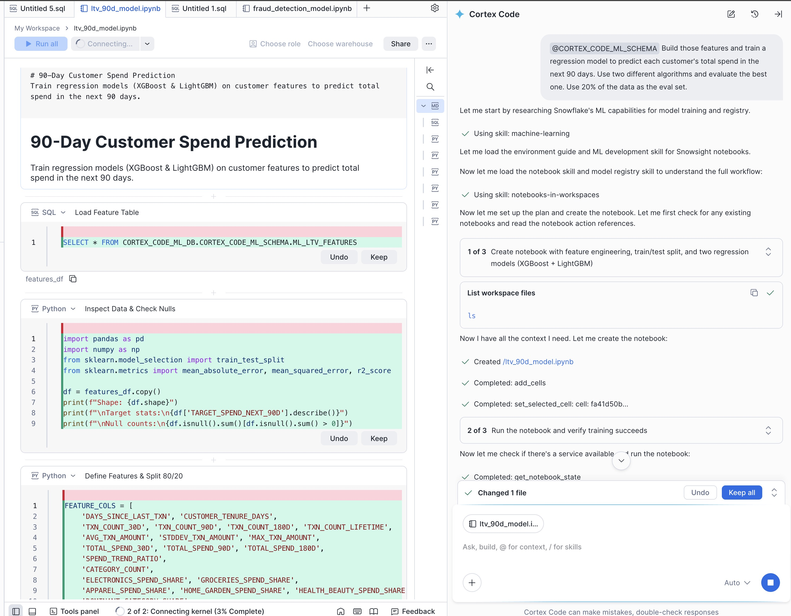
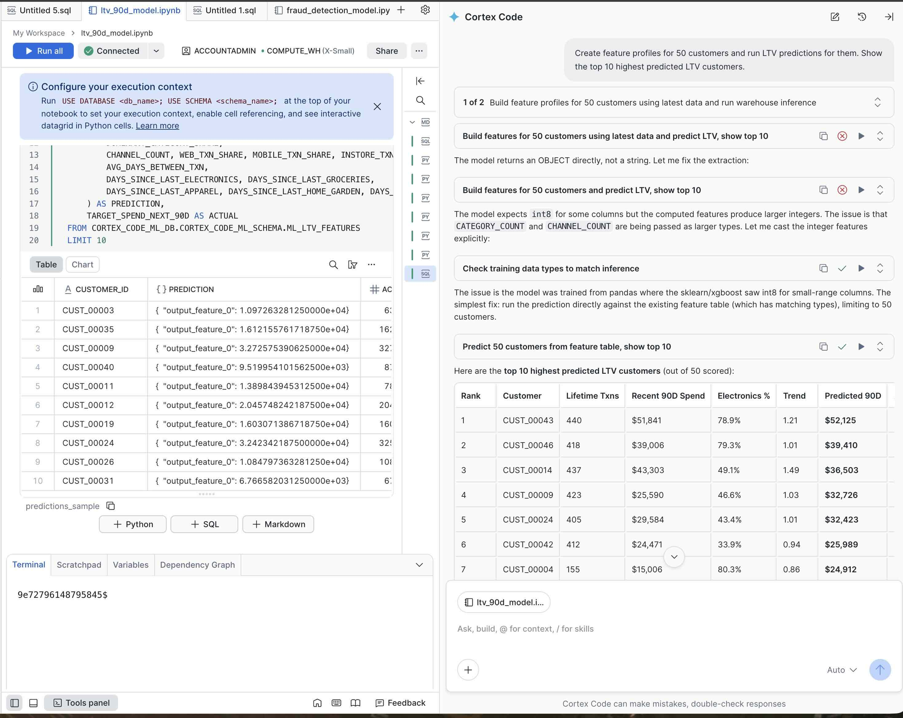

author: Pavan Pothukuchi, Caleb Baechtold, Lucy Zhu, Sho Tanaka
id: getting-started-with-cortex-code-in-snowsight-for-data-science-ml
categories: snowflake-site:taxonomy/solution-center/certification/quickstart, snowflake-site:taxonomy/product/ai
language: en
summary: Build a customer lifetime value (LTV) prediction model end-to-end using Cortex Code in Snowsight — from synthetic data generation to model training, registry, and batch inference.
environments: web
status: Draft
feedback link: https://github.com/Snowflake-Labs/sfguides/issues


# Getting Started with Cortex Code in Snowsight for Data Science ML
<!-- ------------------------ -->
## Overview

[Cortex Code](https://docs.snowflake.com/en/user-guide/cortex-code/cortex-code) is an AI-powered coding agent that helps you build, debug, and deploy Snowflake applications through natural language conversations. In this quickstart, you will use Cortex Code in Snowsight Workspaces to build a complete ML workflow — generating synthetic e-commerce transaction data, performing exploratory data analysis (EDA), training a customer lifetime value (LTV) prediction model, logging it to the Snowflake Model Registry, and running batch inference on a Snowflake Warehouse.

This guide walks through the Snowsight Workspaces experience, which offers an interactive environment with visualizations, a curated Python environment, and automated Notebook cell creation and execution. The same prompts also work in the [Cortex Code CLI](https://docs.snowflake.com/en/user-guide/cortex-code/cortex-code-cli).

> **Important:** Cortex Code is powered by LLMs and is non-deterministic. The code it generates may differ from what is shown in this guide. Always review the output and verify that the results match your expectations before proceeding to the next step.

> If you prefer to use the CLI and deploy to SPCS for real-time inference, see the companion guide: [Getting Started with Cortex Code CLI for Data Science ML](https://www.snowflake.com/en/developers/guides/getting-started-with-cortex-code-cli-for-data-science-ml/).

### What You Will Learn

- How to perform EDA and feature engineering using natural language prompts
- How to train and compare multiple regression models inside Snowflake
- How to log models with metrics to the Snowflake Model Registry
- How to run batch inference on a Snowflake Warehouse

### What You Will Build

An end-to-end customer LTV prediction pipeline including:
- A synthetic e-commerce transactions dataset (~500 customers, ~100,000 transactions over 18 months)
- A trained regression model that predicts a customer's total spend in the next 90 days
- A registered model in the Snowflake Model Registry with evaluation metrics
- Batch inference predictions via Snowflake Warehouse

### Prerequisites

- Access to a Snowflake account with a role that can create databases, schemas, tables, and models. If you do not have access to an account, create a [free Snowflake trial account](https://signup.snowflake.com/?utm_source=snowflake-devrel&utm_medium=developer-guides&utm_cta=developer-guides).
- Familiarity with basic ML concepts (training, evaluation, inference)

<!-- ------------------------ -->
## Setup

**Step 1.** In Snowsight, [create a SQL Worksheet](https://docs.snowflake.com/en/user-guide/ui-snowsight-worksheets-gs#create-worksheets-from-a-sql-file) and open [setup.sql](https://github.com/Snowflake-Labs/cortex-code-samples/blob/main/data-science-ml/setup.sql) to execute all statements in order from top to bottom.

```sql
USE ROLE ACCOUNTADMIN;

CREATE DATABASE IF NOT EXISTS CORTEX_CODE_ML_DB;
CREATE SCHEMA IF NOT EXISTS CORTEX_CODE_ML_DB.CORTEX_CODE_ML_SCHEMA;
CREATE WAREHOUSE IF NOT EXISTS CORTEX_CODE_ML_WH
  WAREHOUSE_SIZE = 'XSMALL'
  AUTO_SUSPEND = 60
  AUTO_RESUME = TRUE;

USE DATABASE CORTEX_CODE_ML_DB;
USE SCHEMA CORTEX_CODE_ML_SCHEMA;
USE WAREHOUSE CORTEX_CODE_ML_WH;

CREATE OR REPLACE FILE FORMAT ml_csvformat
  SKIP_HEADER = 1
  FIELD_OPTIONALLY_ENCLOSED_BY = '"'
  TYPE = 'CSV';

CREATE OR REPLACE STAGE ml_ltv_data_stage
  FILE_FORMAT = ml_csvformat
  URL = 's3://sfquickstarts/sfguide_getting_started_with_cortex_code_for_ds_ml/ltv_transactions/';

CREATE OR REPLACE TABLE ML_LTV_TRANSACTIONS (
	CUSTOMER_ID VARCHAR(16777216),
	TRANSACTION_TIME TIMESTAMP_NTZ(9),
	AMOUNT NUMBER(12,2),
	PRODUCT_CATEGORY VARCHAR(15),
	CHANNEL VARCHAR(8)
);

COPY INTO ML_LTV_TRANSACTIONS
  FROM @ml_ltv_data_stage;

SELECT 'Setup complete — ML_LTV_TRANSACTIONS loaded.' AS STATUS;
```

**Step 2.** Create or open a **Workspace** from the left navigation.

**Step 3.** Open the **Cortex Code** editor from the right-hand side panel.

You are now ready to start prompting Cortex Code to build your ML pipeline.

<!-- ------------------------ -->
## Optional - Generate Synthetic Data

The `setup.sql` in the previous step already loads the `ML_LTV_TRANSACTIONS` table from S3. You can skip this step and proceed directly to Exploratory Data Analysis.

If you want to experience generating data with Cortex Code, use the following prompt. Note that this will **replace** the pre-loaded data.

```
Generate realistic looking synthetic e-commerce transaction data in
CORTEX_CODE_ML_DB.CORTEX_CODE_ML_SCHEMA. Create a table ML_LTV_TRANSACTIONS
with ~100000 transactions from ~500 customers over an 18-month period. Include
CUSTOMER_ID, TRANSACTION_TIME, AMOUNT, PRODUCT_CATEGORY, and CHANNEL. Make the
data realistic: customers should have varying purchase frequencies (some buy
weekly, others monthly), amounts should vary by category (electronics $50-$2000,
groceries $10-$200, apparel $20-$500), and channels should be web, mobile, or
in-store. About 10% of customers should be high-value (frequent buyers with
higher average spend).
```

> Replace `CORTEX_CODE_ML_DB.CORTEX_CODE_ML_SCHEMA` with your target database and schema if you have one.

Cortex Code generates the SQL or Python code to create and populate the table, then executes it in your Snowflake account. You will see the code and results appear in a new Notebook in your Workspace.

<!-- ------------------------ -->
## Confirm Sample Data

Before you start EDA and model training, confirm that the sample dataset is loaded and that Cortex Code is "grounded" to the right database and schema.

### Select the Schema in Cortex Code

1. In your Workspace, open the **Cortex Code** panel on the right.
2. Click **+**.
3. Select **CORTEX_CODE_ML_SCHEMA** (in `CORTEX_CODE_ML_DB`).



### Verify the Table Exists and Has Rows

Use Cortex Code with the following prompt:

```
Confirm that CORTEX_CODE_ML_DB.CORTEX_CODE_ML_SCHEMA.ML_LTV_TRANSACTIONS exists and that it contains data. Show me:
- total row count and number of unique customers
- date range of transactions
- average transaction amount by product category
- a few sample rows
```

If the table is empty (or missing), re-run `setup.sql` from the Setup section and repeat the steps above.

After you run the prompt, you should see a summary (row count, customer count, date range, and category breakdown) and a small sample of rows.




<!-- ------------------------ -->
## Exploratory Data Analysis (EDA)

Next, analyze the patterns in the data to identify the right features for predicting customer lifetime value:

```
Do EDA and recommend the features needed to train a regression model that can predict each customer's total spend in the next 90 days
```

Cortex Code typically breaks this into multiple steps (for example, analyzing purchase frequency, spending distributions, recency patterns, and category preferences) and then summarizes key findings with recommended features.


In this example, Cortex Code identifies signals such as purchase frequency trends, average order value by customer segment, recency of last purchase, and preferred product categories. These insights translate into features like total_transactions, avg_amount, days_since_last_purchase, favorite_category, and channel_distribution.

The EDA step typically reveals patterns such as:
- High-value customers purchase more frequently and have higher average order values
- Recency of last purchase is a strong predictor of future spend
- Certain product categories correlate with higher lifetime value
- Channel preferences (web vs. mobile vs. in-store) vary across customer segments

Cortex Code will recommend features to use in the model based on these findings.

<!-- ------------------------ -->
## Train the Model

Now build the features and train a regression model:

```
Build those features and train a regression model to predict each customer's total spend in the next 90 days. Use two different algorithms and evaluate the best one. Use 20% of the data as the eval set.
```

Cortex Code typically creates a Notebook, generates feature engineering steps, trains two models, and reports evaluation metrics so you can choose the best performer.



In this example, Cortex Code generates Python for feature engineering (aggregating per-customer metrics from the transaction history), runs training/evaluation steps, and produces a comparison section (metrics like RMSE, MAE, and R-squared) to help you pick the best model.

Cortex Code will:
1. Engineer the features based on the EDA recommendations (per-customer aggregations over the training window)
2. Split the data into training (80%) and evaluation (20%) sets
3. Train two different regression algorithms (e.g., Random Forest Regressor and XGBoost Regressor)
4. Compare their performance using metrics such as RMSE, MAE, and R-squared
5. Recommend the better-performing model

Review the evaluation metrics to confirm the model meets your requirements before proceeding.

<!-- ------------------------ -->
## Log to Model Registry

Log the better model to the Snowflake Model Registry configured for Warehouse-based batch inference:

```
Log the better model with metrics into Snowflake Model Registry, and use Snowflake Warehouse for inference.
```

Cortex Code handles the `log_model()` call with appropriate parameters including model metrics, sample input for schema inference, and the target platform set to `WAREHOUSE`.


In this example, the output confirms the model was registered successfully and shows key evaluation metrics (RMSE, MAE, R-squared) recorded with the model version.

<!-- ------------------------ -->
## Run Batch Inference

Generate customer feature profiles and run batch LTV predictions:

```
Create feature profiles for 50 customers and run LTV predictions for them. Show the top 10 highest predicted LTV customers.
```



In this example, Cortex Code generates the customer feature profiles, runs inference via your Snowflake Warehouse, and displays the predicted 90-day spend for each customer (sorted by highest predicted LTV).

Cortex Code creates test customer profiles and calls the registered model's `predict` method using your Snowflake Warehouse. The results include the predicted spend amount for the next 90 days.

<!-- ------------------------ -->
## Conclusion and Resources

Congratulations! You have successfully built and deployed a customer LTV prediction model using Cortex Code in Snowsight — from data generation through batch inference on a Snowflake Warehouse.

### What You Learned

- How to use Cortex Code in Snowsight to generate realistic synthetic data with natural language prompts
- How to perform exploratory data analysis and feature engineering conversationally
- How to train, compare, and select regression models inside Snowflake
- How to log models with metrics to the Snowflake Model Registry
- How to run batch inference on a Snowflake Warehouse

### Related Resources

- [Cortex Code in Snowsight Documentation](https://docs.snowflake.com/en/user-guide/cortex-code/cortex-code-snowsight)
- [Snowflake Model Registry](https://docs.snowflake.com/en/developer-guide/snowflake-ml/model-registry/overview)
- [Best Practices for Cortex Code CLI](https://www.snowflake.com/en/developers/guides/best-practices-cortex-code-cli/)
